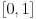
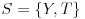
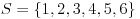
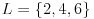
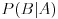

**Olasılık**: Belirsizliğin ölçüsüdür. Her zaman  aralığında değer alır.  
**Deney**:  Sınırsız sayıda tekrarlanabilen ve iyi tanımlı bir sonuç kümesine sahip herhangi bir prosedürdür. Örneğin, bir paranın atılması bir deneydir ve olası sonuç kümesi 'dir. Bu küme _örneklem uzayı_ olarak da adlandırılır.  
**Olay**: Deneyin olası sonuçlarından oluşan bir altkümedir. Örneğin, deney olarak bir zarın bir kez atılmasını düşünürsek, örneklem uzayımız , ve olay olarak da çift sayı gelmesini tanımlarsak,  olur.  
**Koşullu olasılık**: A ve B iki olay olsun.  koşullu olasılığı, A olayı gerçekleştiğinde B olayının gerçekleşme olasılığını ifade eder.  
**Bağımsızlık**: İki olaydan birinin gerçekleşmesi diğerinin gerçekleşme olasılığını etkilemiyor ise bu iki olay bağımsızdır denir. Örneğin, bir parayı defalarca attığımızda, yazı yada tura gelme olasılığı önceki sonuçlardan bağımsızdır.   
